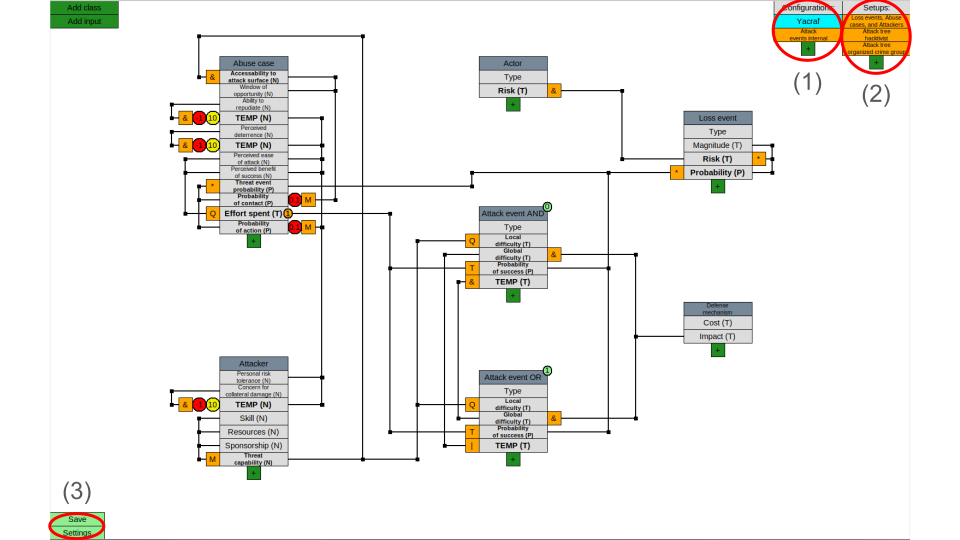
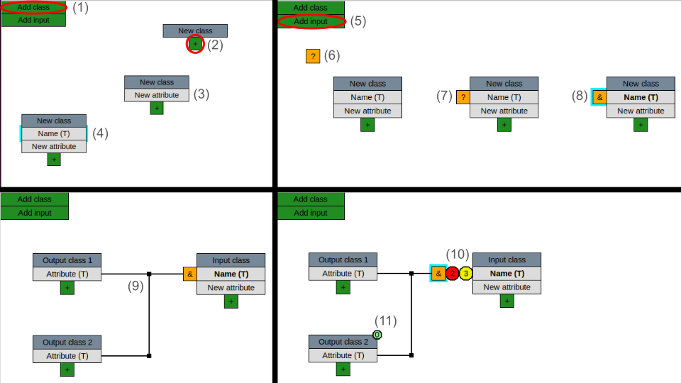
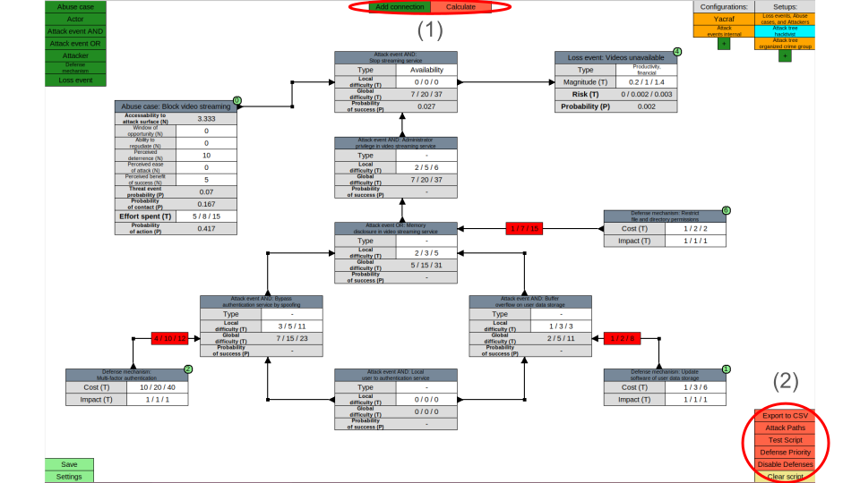
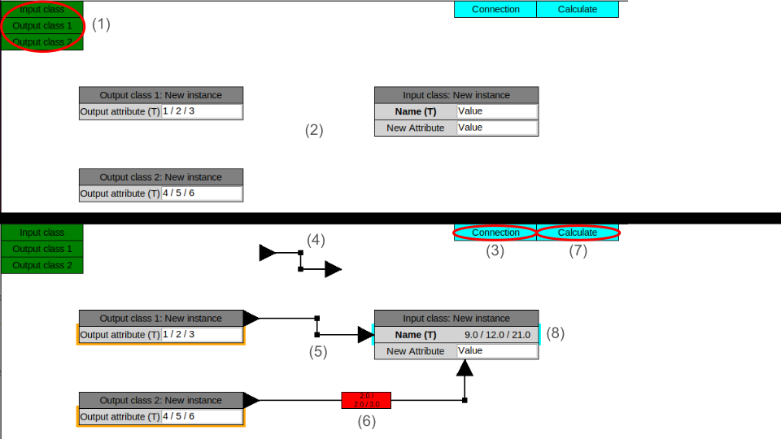
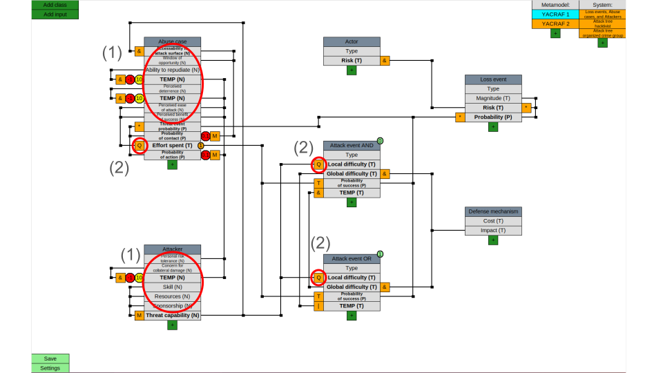

# YACRAF-calculator

This is a graphical tool for doing calculations according to [YACRAF](https://link.springer.com/article/10.1007/s10207-023-00713-y) used in the KTH courses EP2790 and EP279V.

This tool allows calculations inherent to the threat modeling to be set up and calculated using graphical block diagrams, where one can place, drag, and connect different blocks across various `Views`. The tool aims to allow for (i) the automation of the calculation process, where any changes to any block automatically propagate through the system and (ii) the simulation/analysis of various system configurations.

# Table of Contents
1. [Dependencies](#dependencies)
2. [Running the Program](#running-the-YACRAF-calculator)
3. [GUI Overview](#GUI-Overview)
   - [View Switching](#view-switching)
   - [Working with Metamodel Views](#working-with-metamodel-views)
     - [Creating Classes and Attributes](#creating-classes-and-attributes)
     - [Adding Calculation Inputs](#adding-calculation-inputs)
     - [Connections](#connections)
   - [Working with System Views](#working-with-system-views)
     - [Adding Class Instances](#adding-class-instances)
     - [Adding Connections](#adding-connections)
     - [Calculating Values](#calculating-values)
4. [Scripts and Customization](#scripts-and-customization)
5. [Error Handling](#error-handling)
6. [Explanation of the YACRAF Metamodel](#explanation-of-the-yacraf-metamodel)
7. [FAQ](#FAQ)


## Dependecies

The program utilizes Tkinter for its GUI and NumPy for its calculations. If not already installed, Tkinter can on Debian-based Linux distributions (such as Ubuntu) be installed using:

```
sudo apt install python3-tk
```

NumPy can be installed using:

```
pip install numpy
```

Make sure the Python installation is not outdated. The known minimum requirement is Python 3.7, where 3.10 was used during the program's development. You may also need to update NumPy if you get an error related to it when booting the program.

## Running the YACRAF calculator

After navigating to the main directory, run the program using:

```
python3 main.py <save_name>
```

Specifying a save name that does not currently exist will create a completely new save. To see which saves currently exist, run:

```
python3 main.py
```

The default saves of the program contain examples of the YACRAF metamodel, including accompanying system-model examples. The following default saves exist:

1. `example_single`: Example based on the illustrative example found in Section 4 of the YACRAF paper, where the YACRAF metamodel is defined in the corresponding `Metamodel Views`, and the calculations are performed in the `System Views`
2. `example_triangle`: Same as `example_single`, except using triangle distributions whenever applicable
3. `custom`: Same `Metamodel Views` as `exampel_triangle`, but with blank `System Views` to simplify the creation of a new threat model for a different system using the YACRAF metamodel

## GUI Overview

The graphical interface consists of two types of `Views`: `Metamodel Views` (`Configuration Views`) defining the metamodel used during the threat modeling and `System Views` (`Setup Views`) where the specific analyzed system is defined based on the aforementioned metamodel. That is, `Class` blocks (for example, an attack event) and their `Attributes` (for example, the attack event's cost) are defined within `Metamodel Views`, including their connections and relationships to other `Attributes`. For instance, specifying that the cost `Attribute` of one attack event is dependent on that of another. Meanwhile, attack event instances (such as a DDoS attack) and their connections to other system-specific instances are configured in the `System Views`.


### Views Switching 

In the top right corner of the GUI are two columns of buttons - see (1) and (2) in the figure below. The figure shows a `Metamodel View`. These buttons switch between the different `Views`, where the left-most column switches between `Metamodel Views` and the right-most between `System Views`. The button with the `+` allows for an additional `View` to be added. The current `View` can be configured by pressing E (for edit) when no block inside the `View` is selected (will edit the block otherwise), whereas one for a `Metamodel View` can:

1. Change its name
2. Switch their button order
3. Delete it

For a `System View`, one can:

1. Change its name
2. Switch their button order
3. Create a copy of it
4. Temporarily exclude it from current calculations
5. Delete it

The save button in the bottom left corner ((3) in the below figure) saves the current state of all `Metamodel Views` and `System Views`, but also any changes to the general settings found by pressing the settings button. Any selected block within a `View` can be deleted by pressing backspace.



### Working with Metamodel Views

#### Creating Classes and Attributes

A new metamodel `Class` is created by pressing the add class button in the top left corner, as illustrated by (1) in the figure below. By pressing (2), one can add an `Attribute` to the created `Class` (result shown in (3)). Pressing an `Attribute` selects it, as shown by (4), where one can edit it by pressing E. Editing an `Attribute` allows the following to be configured:

1. Its name
2. Their displayed order in the `Class`
3. The value type of the `Attribute`, such as a single number, probability, or a triangle distribution (the (T) at (4) indicates that the `Attribute` value is a triangle distribution)
4. Hide it from the corresponding `System Views`, meaning it is only visible in the `Metamodel Views` (useful for calculations requiring several steps)

Similarly, the `Class` itself can also be edited. In particular:

1. Changing its name
2. Creating a linked copy of this instance in another `Metamodel View` (allowing relations between blocks across multiple `Metamodel Views` - interpreting them as the same `Class` block), identified by a unique identifier in their upper right corner (see (11) in the figure below)



#### Adding Calculation Inputs

By pressing the add input button in the top left corner (see (5) in the above figure), an `Input` block is created (see (6)). `Input` blocks take input values from one or more `Attributes` and, through a specified mathematical operation, outputs the calculated result to an adjacent `Attribute` that it has been dragged next to (see (7)). The `Input` block can be configured by selecting it and pressing E, where one can:

1. Change its mathematical operation, for example, AND, OR, multiplication, etc (seen at (8) is the an `Input` block performing an AND operation between inputs)
2. Add a scalar that multiplies the calculated input with a factor (see the number 2 at (10))
3. Add an offset that is added after the scalar is applied (see the number 3 at (10))

`Attributes` can be added as inputs by connecting them to the `Input` block by first right-clicking on the corresponding `Attribute` and then left or right-clicking the `Input` block, creating a `Connection` between the two, as illustrated by (9) in the above figure.

Some mathematical operations are dependent on the order of their inputs. In such cases, the `Connections` will automatically be graphically enumerated by the order they were created.

##### Connections

Pressing E when the corner of a `Connection` is selected opens up its options, where one can:

1. Set the `Connection` as external, meaning it will only be connected to `Attributes` of other class instances, ignoring internally connected ones, leading to, for example, an attack event only considering the corresponding `Attribute` value of other attack events and not its own (indicated by its lines becoming dashed)

The corners of a `Connection` can be dragged around to customize its path.

### Working with System Views

Shown in the figure below is an example of a `System View` reflecting the system that the metamodel from the corresponding `Metamodel Views` has been applied to. The buttons at (1) in the figure are used to create `Connections` between `Classes` and calculate the final values, respectively. (2) shows buttons for running custom scripts that can calculate/simulate different scenarios throughout the `System Views`. Scripts are explained in detail later.



#### Adding Class Instances

An instance of a `Class` from a `Metamodel View` can be added to the current `System View` by pressing the corresponding button in the top left corner, as shown by (1) in the `System View` in the below figure. The `Class` instances can be configured by pressing E when selected, where one can:

1. Change the name of the corresponding `Class` instance
2. Create a linked copy of the instance to another `System View` (any calculated value takes all linked versions into account), identified by a marker in their upper right corner (see (3) in the figure below)



#### Adding Connections

Pressing the add connection button at the top ((4) in the above figure) creates a directional `Connection` (see (5)) that can be attached to `Classes` (see (6)) by dragging its corresponding ends. The `Attributes` of the `Class` that the `Connection` points to may take input from the other `Class` if such `Attribute` relations have been configured in the `Metamodel Views`. Attaching a `Connection` to a `Class` will automatically disable `Attribute` entry fields if the corresponding value is dependent on at least one connected `Class`. By pressing E after selecting a corner on the directional `Connection`, one can:

1. Add a scalar that is applied to input values obtained through the `Connection`, where the appearing indicator (see (7)) can be dragged along the path of the `Connection`

##### Calculating Values

The calculate button at the top (see (8)) calculates the values of all `Attributes` that do not have a manual input entry field. Calculated are the `Attributes` of all `Classes` in all `System Views`. In the case of the above figure, the `Attribute` indicated by (9) has been calculated using the corresponding `Attribute` values of its input `Classes`. The input `Attributes` in question are highlighted when the `Attribute` is selected.

#### Scripts and Customization

Scripts to visualize or analyze different scenarios, such as finding the most optimal order of implementing defense mechanisms or enumerating and visualizing the easiest attack paths, can be created using Python scripts that interface to the tool. Scripts are created and explained in detail in the `scripts` directory.

Note: Computationally heavy scripts could take some time to complete. The corresponding button will appear pressed (have changed color) while the script is running.

### Error Handling

Any errors found in the `Metamodel Views` or `System Views` upon calculating `Attribute` values are printed.

## Explanation of the YACRAF Metamodel Included in the Program

The attributes highlighted by (1) in the figure below have been configured to take an input between 0-10, where the sequence of &, 0.1, and 10 into a temporary (and hidden) `Attribute` is used to make a negative formulation of the `Attribute` into a positive one, or vice versa. For example, transform a 3 into 10 - 3 = 7.

The calculation type Q (see (2)) implies a qualitative relation where no numerical calculation is performed. Instead, manual input is prompted. Thus, such connections merely highlight the relationship.



## FAQ 
#### Q1: What exactly does the YACRAF Calculator calculate?

**A1:** The YACRAF Calculator performs automated cyber risk assessments based on the YACRAF framework. It uses block diagrams to represent a metamodel of threats, system attributes, and relationships. The tool calculates how changes in attributes (such as attack likelihood or impact) propagate through the system, generating risk scores or other evaluation metrics.


#### Q2: How is the YACRAF Calculator structured?

**A2:** The YACRAF Calculator is structured around two views: **Metamodel Views** and **System Views**. Metamodel Views define the YACRAF threat model, where `Class` blocks and `Attributes` are created, along with their relationships. System Views apply this model to specific scenarios, allowing users to configure instances, connect blocks, and run calculations. This structure separates the model design from its application.


#### Q3: Should I modify the metamodel provided in the custom example?

**A3:** We recommend sticking to the provided YACRAF metamodel for consistency and reliable results. However, you can use a different model if needed.


#### Q4: Can YACRAF handle multiple System Views for the same Metamodel?

**A4:** Yes, YACRAF allows multiple System Views for the same Metamodel. You can create different system setups, such as modeling a DDoS attack in one view and a phishing attack in another, all while using the same underlying Metamodel.


#### Q5: What resources are provided, and which should I use?

**A5:** We provide some System Views to help you get started:  

- **example_single:** Based on Section 4 of the YACRAF paper.  

- **example_triangle:** Similar to `example_single` but with triangle distributions.  

- **custom:** Blank System Views with the YACRAF metamodel for creating your own models.  

We recommend using the custom save to design your own threat models.


#### Q6: How do I edit or delete blocks and Views?

**A6:**  

- **Edit a block or View:** Select it and press `E`.  

- **Delete a block:** Select it and press the `Backspace` key.  

- **Delete a View:** Edit the View (press `E` when no block is selected) and choose the delete option.


#### Q7: How do I create and use connections between classes and attributes?

**A7:** Connections between attributes or classes are made by right-clicking an attribute and then clicking on the destination block. These connections define the flow of information or dependencies between different blocks, such as linking the cost of one attack to another attack’s likelihood. You can further configure these connections, making them external or modifying the flow based on the system’s needs.


#### Q8: What mathematical operations are available for calculations?

**A8:** The YACRAF Calculator supports operations like AND/OR gates, multiplication, addition, and custom scalars or offsets. These can be defined within Input blocks to control how attributes interact.


#### Q9: What does setting a Connection as "external" do?

**A9:** An external Connection links Attributes only to other Class instances, excluding internal Attributes. It is indicated by a dashed line in the Metamodel View.


#### Q10: How do I create linked copies of Class instances?

**A10:** When editing a Class or Class instance (press `E`), choose the option to create a linked copy. Linked copies share calculations and are identified by a unique marker in the upper-right corner.


#### Q11: How do scalars and offsets work in Input blocks and Connections?

**A11:**  

- **Scalars:** Multiply the input value by a specified factor.  

- **Offsets:** Add a specified value after scaling.  

- **Setting Scalars/Offsets:** Edit the Input block or Connection (select and press `E`) and enter the desired values.


#### Q12: How does the tool ensure consistency between metamodel and system views?

**A12:** Consistency is maintained by linking the metamodel and system views. Any changes made to the Metamodel Views are automatically reflected in the corresponding System Views. This ensures that changes in the underlying structure, such as attribute definitions or class relationships, are consistent across all system-specific simulations.


#### Q13: What happens if I delete a class or attribute from a view?

**A13:** When you delete a class or attribute, all connections and relationships associated with that block are also removed. Any calculations that relied on the deleted components will need to be re-evaluated based on the new model structure.


#### Q14: How do I handle errors during calculations?

**A14:** Errors are displayed in the console when calculations are performed. Ensure all required inputs and Connections are correctly configured. Check for any missing dependencies or outdated packages.


#### Q15: How do I save my work?

**A15:** Click the "Save" button located at the bottom-left corner of the GUI. This saves all current Metamodel Views, System Views, and general settings.


#### Q16: How are Views organized within a save?

**A16:** Within each save directory:  

- **configuration directory:** Contains Metamodel Views.  

- **setup directory:** Contains System Views.  

- **view_file_paths.txt:** Specifies the paths and order of active Views.


#### Q17: What happens if I delete a View from within the GUI? Can it be recovered?

**A17:** If a View is deleted from within the GUI, it is not permanently removed from the save directory unless another View with the same name overwrites it. The deleted View will remain in the corresponding folder, allowing you to recover it later if necessary. This ensures that accidentally deleted Views can be restored without data loss.


#### Q18: How do I recover a deleted View?

**A18:** To recover a deleted View, navigate to the save directory and check the configuration or setup directories for the file corresponding to the deleted View. You can manually restore it by referencing its file or re-adding it to the `view_file_paths.txt` if needed.


#### Q19: Can I rename or move save directories?

**A19:** While it’s technically possible to rename or move save directories outside of the GUI, doing so manually might cause inconsistencies in how the views are referenced within the `view_file_paths.txt`. It’s recommended to handle any save-related actions (like renaming or deleting) within the GUI to maintain proper references between files.


#### Q20: What if I want to create a backup of my saves?

**A20:** To back up your saves, you can simply copy the entire save directory to another location. Since each save is self-contained within its directory (including both the configuration and setup views), copying this folder ensures that all related files, including the `view_file_paths.txt`, are preserved.


#### Q21: What are scripts in the YACRAF Calculator?

**A21:** Scripts are Python files used to automate tasks, run simulations, or analyze scenarios within the tool. They interact with the model and system configurations.


#### Q22: What scripts are available?

**A22:** The available scripts include:

- **optimal_order_defense.py:** Calculates the best order for implementing defenses.

- **enumerate_easiest_attack.py:** Identifies the easiest attack paths.

- **show_critical_instances.py:** Highlights critical system components.


#### Q23: Can I add more scripts?

**A23:** Yes, while we don’t require you to add scripts for the project, you are free to create them if needed. To add a script, copy and modify the `SCRIPT_TEMPLATE.py` file. The new script will appear in the GUI for activation.


#### Q24: How do I activate scripts in the YACRAF calculator?

**A24:** Once the calculator is running, a button for each script will appear in the bottom right corner of the System Views. You can click the button to execute the script and see the results within the interface.


